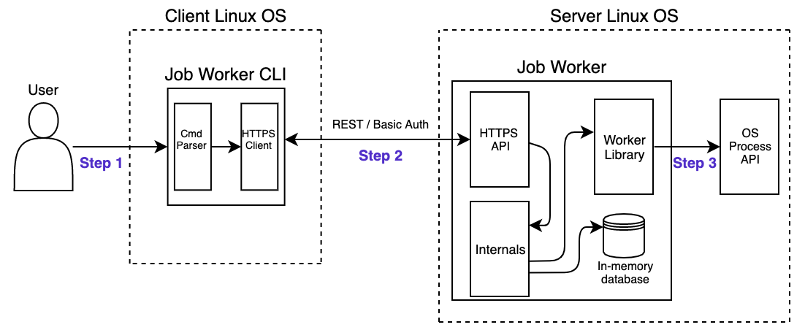

# Job Worker Design Document

This document describes the key design choices and trade-offs for the development of the Job Worker, an application
that enables the execution of arbitrary linux processes remotely. <strong>Users that interact with the system are able to start, stop,
query status and also read the stdout logs</strong> of any requested process execution.

## Architecture overview

The application is composed of 2 components: The CLI and the Server. The former is responsible for parsing user input and translating it
into REST HTTPS requests. The Server receives such requests, maintains internal in-memory state and manages the pool of linux processes that are spawned
along with their status.

It's possible to see numbers 1, 2 and 3 in the image below, each representing a different step of a user request. Each step of the request will be described in
details later in this document, but for now, here is a summary of what's happening:

* <strong>Step 1</strong>: After logging in using a basic username/password authentication mechanism, the user types a CLI command requesting one of the possible
  interactions with a linux process.

* <strong>Step 2</strong>: The CLI application parses the user's command and translates it into an HTTPS request for the Server. The API module of the Server receives
  the request, checks if the input is valid and verifies if the user is authorized to perform the requested operation.

* <strong>Step 3</strong>: If all validations pass, the API module will forward the request to the corresponding internal handler [1].
  It will do business logic, access the persistence layer and invoke the OS Process API with the Worker Library when necessary.



<strong>PS:</strong> The image depicts a situation where the CLI and the Server are running on separate machines/OS, which is not always the case. This was intended to highlight the necessity
of creating a secure channel between them.

The next sections will describe in details each of key aspects of the 2 components of the system. The design decisions and trade-offs will be shown in a way that by the end of the
document the reader will have a "grey-box" understanding of the entire system (i.e. Some internal nuances will be mentioned, but not all of them for the sake of readability. These
will be further discussed during application development.)

## CLI

The Job Worker CLI is the user interface of the Job Worker Service. Its responsibility is to authenticate the user with the Server, parse commands, generate authenticated HTTPS requests
and exhibit the responses in a structured manner. This section will:

1. Describe which commands are available for the user and how to use them;
2. Describe how the CLI will manage user secrets (i.e. username/password);
4. Show the trade-offs and what could and should be done for future work.

### Commands

* [Login](cli/login/login.md): `job-worker login SERVER_URL`
* [Create Job](cli/jobs/create-job.md): `job-worker exec COMMAND [ARG...]`
* [List Jobs](cli/jobs/list-jobs.md): `job-worker list`
* [Stop Job](cli/jobs/stop-job.md): `job-worker stop JOB_ID`
* [Get Job Status](cli/jobs/get-status.md): `job-worker status JOB_ID`
* [Get Job Logs](cli/jobs/get-logs.md): `job-worker logs JOB_ID`

### Managing User Secrets

The CLI login command will follow a very similar approach to what `docker login` does with its default configuration mechanism [5]. It
receives user input in the username/password form and then invokes the [login api](api/login/login.md). If a `200 Ok` is
received, then a new folder `$HOME/.job-worker` will be created if it doesn't exist. A `config.json` inside this folder will contain
the current active login "session" (it won't be a real session because we are not using expiring tokens). This is what the file
will look like:

<strong>Example command:</strong> `job-worker login https://my-server.example:443`

<strong>Resulting `config.json` file:</strong>
```
{
  "server": https://my-server.example:443
  "authToken": "ZGVtbzpwQDU1dzByZA=="
}
```

The CLI config.json file will have the same permissions of the docker `config.json` file: `-rw-------` (i.e. only read and write permissions
for the file owner).

<strong>PS:</strong> If the `config.json` file doesn't exist, the user will be oriented to invoke the login command.

### Trade-offs

* Even with the correct file permissions, saving the basic authentication token in a file is a bad practice. A better approach would be store these secrets inside a keychain, or save a JWT token with
an expiration time.
  
### Future work

## Server

The Job Worker Server is responsible for receiving HTTPS requests, applying validations, and executing the requested action if possible. This section will:

1. Describe which actions are available for requests and how the Server expects to receive them;
2. Describe how the Server will handle security concerns (Authentication and Authorization);
3. Explain briefly how the Server will keep track/state of every spawned process;
4. Show the trade-offs and what could and should be done for future work.

### REST API

#### Jobs:
* [Create Job](api/jobs/create-job.md): `POST /jobs`
* [Get Jobs](api/jobs/get-jobs.md): `GET /jobs`
* [Stop Job](api/jobs/stop-job.md): `POST /jobs/:id/stop`
* [Get Job Status](api/jobs/get-status.md): `GET /jobs/:id/status`
* [Get Job Logs](api/jobs/get-logs.md): `GET /jobs/:id/logs`

#### Login:
* [Login](api/login/login.md): `POST /login`

### Security

The Job Worker Service will use HTTPS (TLS 1.2) + Basic Authentication (i.e. username/password) in its initial version. Authorization
will take form with the following roles: `Admin`, `Maintainer`, `Developer` and `Reader`.

#### Authentication
Every request made to the Server must contain an authorization header in the form `Authorization: Basic <credentials>`,
where `<credentials>` is the base64 encoding of username and password joined by a single colon `:` [2].

After receiving the request, the Server will check if the username/password pair is valid and if it matches any user in
its in-memory database. If the request is not valid, a `401 Unauthorized` will be returned.

#### Authorization

Authorization will be handled with a simple RBAC mechanism. There will be 4 types of roles, each with
a set of permissions associated with it.

<strong>PS: Stub users will be created as seed data when the Server starts. There will be no users CRUD in the initial version. Some permissions won't be enforced until then. </strong>


|  Roles               |  Permissions         | Description |
| :-------------------:| :-------------------:| :-----------: |
|  Admin | jobs.create, jobs.get, jobs.logs, jobs.stop, users.create, users.update | Can update users + all Maintainer permissions|
|  Maintainer | jobs.create, jobs.get, jobs.logs, jobs.stop, users.create | Can create new users + all Developer permissions|
|  Developer | jobs.create, jobs.get, jobs.logs, jobs.stop | Can create/stop jobs, view jobs logs + all Reader permissions|
|  Reader | jobs.get | Can view all jobs and their status|

When receiving an authenticated request, the Server will always check if the user has enough permissions to access the resource. If not, `403 Forbidden` will be returned.

<strong>PS: For now, role/user relationship will be one to many.</strong>

### Managing Linux Processes

The Golang exec package [4] will be responsible for the interaction with the operating system. This package will be used by the Server in a library that could be imported by
any Golang project that  wishes to do any of the following actions on linux processes: `create`, `stop`, `read logs`.

In order to keep track of processes (jobs) data, the Server will persist their data and update it according to the outputs of the `exec` package commands.

Jobs will have 4 possible states:

* <strong>RUNNING:</strong> Process is currently running with no errors;
* <strong>FAILED:</strong> Process finished with errors;
* <strong>STOPPED:</strong> Process was forced to stop by a user;
* <strong>COMPLETED:</strong> Process finished without errors.

Job states will be stored in the job object inside the in-memory database. One goroutine will be created for each job, and each will perform a database write/update on a
different record.

### Trade-offs

* No network isolation between processes. This might lead to some problems such as network ports outage (i.e. only one process can listen on a port at a given time);
* No resource pagination on the API services. This is not scalable but is not necessary for the first version;
* Basic authentication is not enough;

### Future work

* Implement mTLS;
* Use network namespaces;

## References

[1] https://crosp.net/blog/software-architecture/clean-architecture-part-2-the-clean-architecture/

[2] https://en.wikipedia.org/wiki/Basic_access_authentication

[3] https://medium.com/bluecore-engineering/implementing-role-based-security-in-a-web-app-89b66d1410e4

[4] https://golang.org/pkg/os/exec/

[5] https://docs.docker.com/engine/reference/commandline/login/